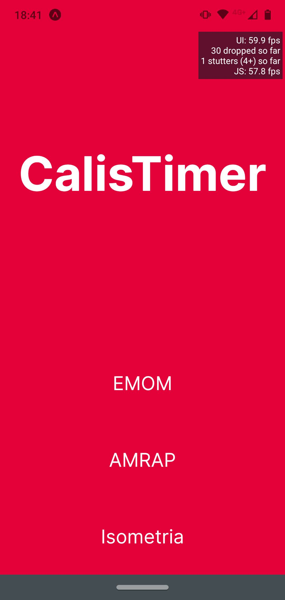
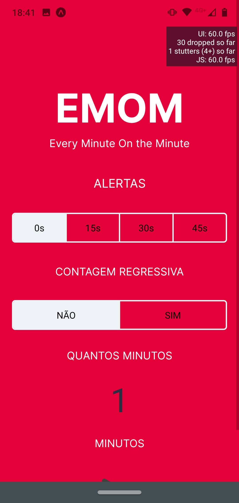
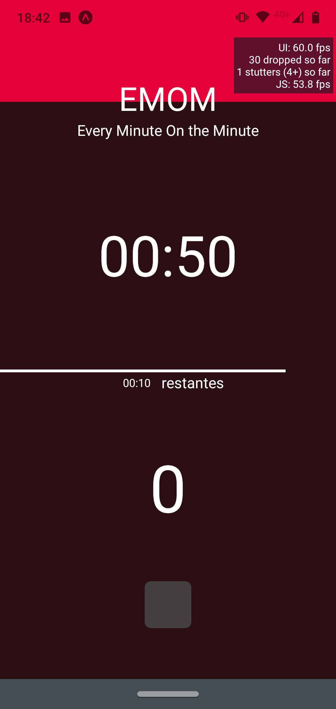
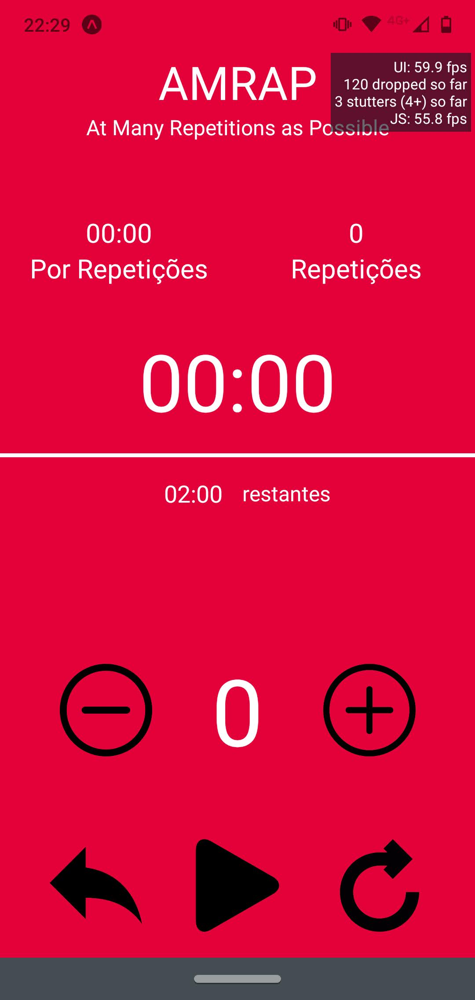
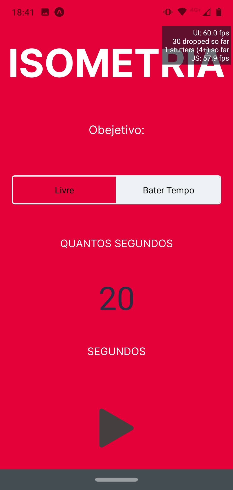

# CALISTIMER

Aplicativo construido durante as aulas do curso de ReactJS/React-Native do DevPleno, o devReactJS nos módulos de react-native.

## Telas

### about

### home

### emom

### amrap

### isometria

